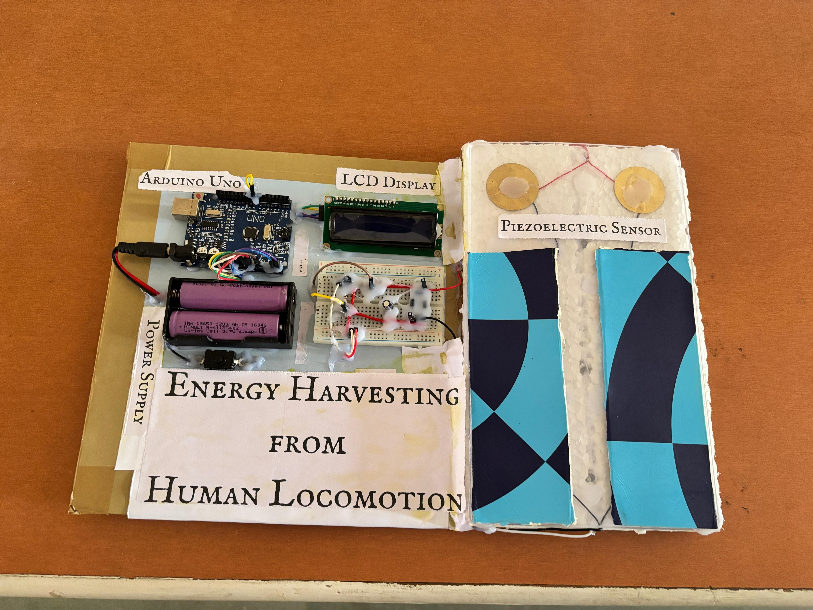
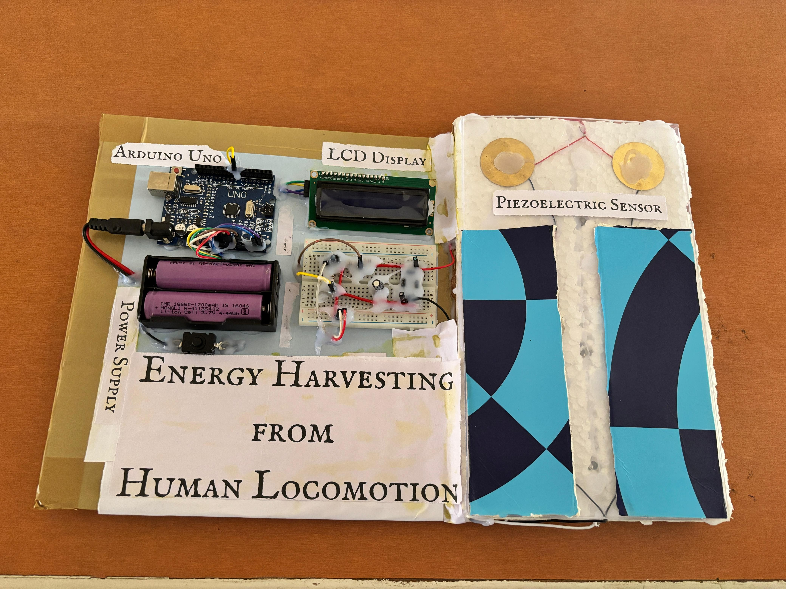

# Energy-Harvesting-System
Arduino-based Energy Harvesting System generating electrical energy from human motion for portable and smart power applications.
## Features
- Generates electrical energy from human motion
- Mechanical to electrical energy conversion
- Low-cost and portable system
- Suitable for wearable or smart floor applications

## Components Used
- DC Generator / Dynamo
- Rectifier Circuit
- Voltage Regulator
- Rechargeable Battery
- Connecting Wires
- Mechanical motion setup

## Applications
- Wearable energy harvesting
- Smart shoes & smart floors
- Emergency mobile charging
- Portable power generation

## Arduino Code

```cpp
// Energy Harvesting Monitoring Code

const int sensorPin = A0;
float voltage = 0.0;

void setup() {
  Serial.begin(9600);
}

void loop() {
  int sensorValue = analogRead(sensorPin);
  voltage = sensorValue * (5.0 / 1023.0);

  Serial.print("Generated Voltage: ");
  Serial.print(voltage);
  Serial.println(" V");

  delay(500);
}
```

## Author
Md Istaque Ansari  
B.Tech Electronics & Communication Engineering Student  
Embedded Systems & Arduino Project Developer focused on practical, real-world engineering solutions.  
Actively building industry-ready technical skills and seeking opportunities to contribute in innovative engineering and technology projects.

## Project Demo





